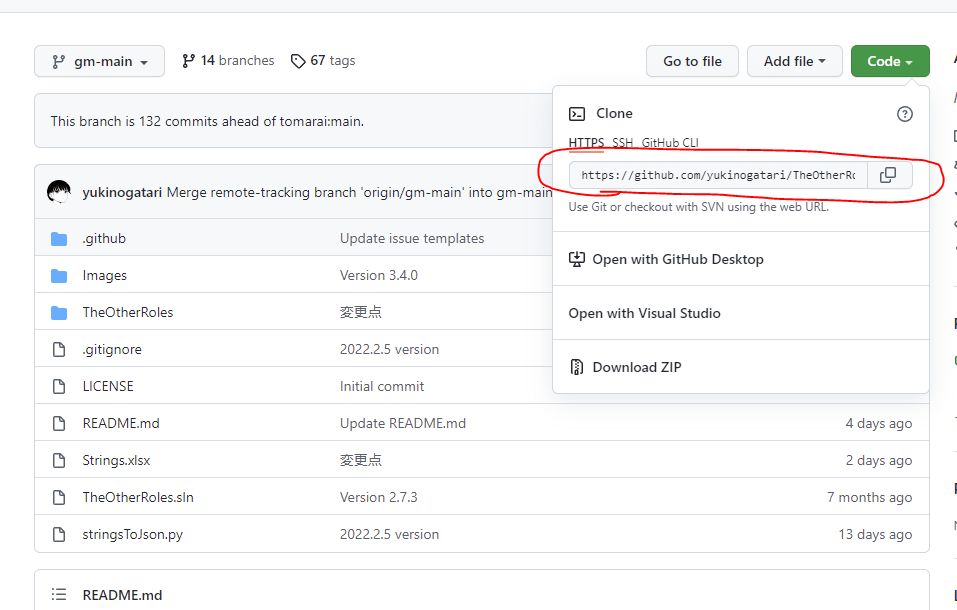

# 1. プルリクエストを発行するまでに必要な手順

<!-- TOC -->

- [1. プルリクエストを発行するまでに必要な手順](#1-プルリクエストを発行するまでに必要な手順)
	- [1.1. はじめに](#11-はじめに)
	- [1.2. 初回のみ実施](#12-初回のみ実施)
		- [1.2.1. Gitクライアントのインストール](#121-gitクライアントのインストール)
		- [1.2.2. GitHubアカウントの作成](#122-githubアカウントの作成)
		- [1.2.3. TheOtherRoles GMをフォークする](#123-theotherroles-gmをフォークする)
		- [1.2.4. ローカル環境にTheOtherRoles GMをクローン](#124-ローカル環境にtheotherroles-gmをクローン)
		- [1.2.5. クローンした環境のリモート先にHaomingフォークを追加](#125-クローンした環境のリモート先にhaomingフォークを追加)
		- [1.2.6. クローンした環境のリモート先に鳴海フォークの接続を追加](#126-クローンした環境のリモート先に鳴海フォークの接続を追加)
	- [1.3. プルリクエストを発行する都度実施](#13-プルリクエストを発行する都度実施)
		- [1.3.1. 変更を反映させたい環境をベースにブランチを作成](#131-変更を反映させたい環境をベースにブランチを作成)
		- [変更をローカル環境に反映する](#変更をローカル環境に反映する)
		- [変更を自身のフォーク先に反映する](#変更を自身のフォーク先に反映する)
		- [GitHubのWEBのUIからプルリクエストを発行する](#githubのwebのuiからプルリクエストを発行する)

<!-- /TOC -->

## 1.1. はじめに
鳴海さんがプルリクエストを発行できるようになるまでに必要なことをまとめる


## 1.2. 初回のみ実施
初回のみ実施する手順をここに記す
### 1.2.1. Gitクライアントのインストール
下記をダウンロードしてインストールする  
文字コード変換の設定は基本的にOFFにしておくこと推奨   

https://git-scm.com/download/win

### 1.2.2. GitHubアカウントの作成
下記のリンクからアカウントを作成する  
https://github.com/signup

### 1.2.3. TheOtherRoles GMをフォークする
下記のリンクを開く  
https://github.com/yukinogatari/TheOtherRoles-GM  

右上にあるforkボタンを押してフォーク環境を作成する

### 1.2.4. ローカル環境にTheOtherRoles GMをクローン
緑色のCodeボタンをクリック後に表示されるURLをコピーする


コマンドプロンプト or　PowerShellを開いてソースコードをダウンロードしたいディレクトリに移動して下記のコマンドを実行
```bash
$ git clone https://github.com/yukinogatari/TheOtherRoles-GM.git
$ git remote rename origin dusk
```
### 1.2.5. クローンした環境のリモート先にHaomingフォークを追加
VSCodeでクローンしたフォルダを開く    
Ctrl+`を押下してターミナルを開いて下記のコマンドを実行
```bash
$ git remote add haoming https://github.com/haoming37/TheOtherRoles-GM-Haoming.git
```
### 1.2.6. クローンした環境のリモート先に鳴海フォークの接続を追加
VSCodeでクローンしたフォルダを開く    
Ctrl+`を押下してターミナルを開いて下記のコマンドを実行
```bash
$ git remote add narumi https://github.com/<鳴海さんのアカウント名>/TheOtherRoles-GM.git
```

## 1.3. プルリクエストを発行する都度実施

### 1.3.1. 変更を反映させたい環境をベースにブランチを作成
※narumi_workは適当な名前で良い  
※下記の例はhaoming-mainブランチを修正したい場合
```bash
$ git fetch haoming
$ git checkout -b narumi_work haoming/haoming-main
```

### 変更をローカル環境に反映する
必要なファイルを修正後に下記のコマンドを実行する
```bash
$ git add <修正したファイル>
$ git commit -m "<修正内容を書く>"
```

### 変更を自身のフォーク先に反映する
```bash
$ git push narumi narumi_work
```

### GitHubのWEBのUIからプルリクエストを発行する
自身のフォーク先のページのPull requestsボタンを押下

New pull requestsボタンを押下

①を変更を適応したいブランチに指定(例. haoming37/haoming-main)  
②を自身の作成したブランチに指定(例. narumi/narumi_workなど)
③Create pull requestを押下する

変更内容などの説明を入力する画面が出てくるのでなんとなくで記入する  
Create pull requestボタンを押下したら終了
